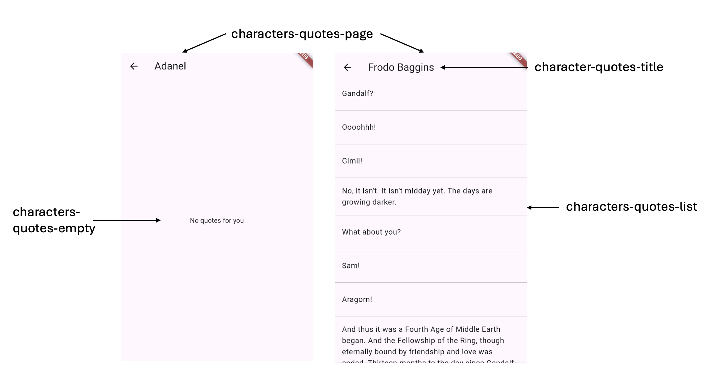

# Exercício Flutter - LOTR Characters

## Objetivo

O objetivo deste exercício é desenvolver uma aplicação em flutter que lista um conjunto de personagens do LOTR (Lord of the Rings),
para cada personagem conseguimos consultar o seu detalhe bem como as falas.

O exercício tem 2 partes. 

### 1ª parte

Na 1ª parte, deverás seguir as instruções das partes 1, 2 e 3 desta [playlist](https://www.youtube.com/watch?v=x0tIkh1vb7k&list=PLGtUp9f8b5M2hktI5znPykHod2zl5td8g&ab) 
para implementar:
- A obtenção dos personagens a partir de um servidor
- O ecrã que mostra a lista de personagens
- O ecrã que mostra o detalhe de cada personagem

Nota: A playlist tem mais partes (4, 5 e 6) que têm a ver com a possibilidade de correr a aplicação em offline. Neste exercício, **não se pretende**
que implementem essa possibilidade.

### 2ª parte

Uma vez que a 1ª parte pode ser implementada diretamente a partir dos vídeos, introduzimos uma funcionalidade extra que não está explicada
nos mesmos.

Pretende-se que, a partir do detalhe de um personagem, seja possível obter frases (quotes) desse personagem. Isso implica aceder a
outro endpoint da API e mostrar as frases num novo ecrã.

No vídeo abaixo, pode-se ver uma demonstração desta nova funcionalidade.

## Exercício

Este repositório foi criado já com a estrutura (em termos de ficheiros) da aplicação, só tens que criar o código necessário
dentro desses ficheiros. Já existe algum código criado para customizar o tema da aplicação.

Estão também incluídos dentro da pasta test ficheiros que permitem correr uma série de testes. Não deves alterar
estes ficheiros. Deves, no entanto, utilizá-los para validar localmente que implementaste corretamente a aplicação.

Além disso, estes testes vão ser executados de cada vez que fazes push para o repositório[^1].

Estes testes assumem que alguns dos widgets têm uma chave específica associada, vê nas imagens abaixo quais são essas chaves:

### Lista de personagens

### Detalhe do personagem

### Quotes do personagem

## Pressupostos

Deves desenvolver a aplicação tendo em conta estes pressupostos, até que ela:
* Tenha o aspeto e comportamento apresentado na demonstração acima
* Passe os testes (unitários e integração) mas também o [dart analyze](https://dart.dev/tools/dart-analyze) que pode ser executado localmente através do comando `dart analyze` na consola do Android Studio

Este exercício pressupõe que sabes usar o `Provider`, sabes como consumir uma API REST e sabes tirar partido do `FutureBuilder` para mostrar um `CircularProgressIndicator` enquanto a aplicação está à espera
de resposta do servidor. Tudo isso foi explicado na playlist indicada no início do enunciado.

Pressupõe também que sabes o que são testes de integração e a importância do `Provider` para esses testes. Essa parte está explicada
neste [video](https://www.youtube.com/watch?v=22WyA_NVkLk).

## Dicas técnicas
Todos os dados necessários para o desenvolvimento desta aplicação estão disponíveis [nesta API](https://the-one-api.dev).

Os títulos dos ecrãs / páginas devem ser colocados num widget `Text` dentro de uma `AppBar`.

O texto "name - race" (ambos atributos da classe `Character`) deve ser implementado através do método `toString` da classe `Character`.

A classe `Quote` deve ter apenas 2 atributos `id` e `dialog`, que serão obtidas através do endppoint relativo às quotes.

[^1]: Por razões de desempenho, neste momento, os testes de integração não estão a ser executados no github.